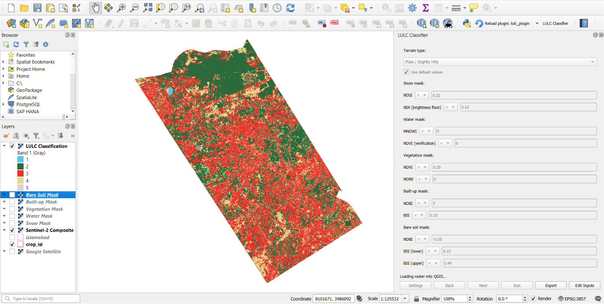

# LULC Classifier

A QGIS plugin that performs Land Use / Land Cover (LULC) classification for any study area using Sentinel-2 imagery processed through Google Earth Engine.

---

## Motivation

Manually classifying land cover in GEE for a new study area means rebuilding the same composite, index, and masking workflow from scratch every time, even if the purpose is just to know the general classification sometimes to aid in analysis. This plugin turns that workflow into a repeatable tool, set an area, a date range, and a terrain type, and get a five-class classification without rewriting any code, and if the result is to your liking you can export it, if not then the virtual layers can aid you in your analysis. It's based on spectral indexes and the thresholds have been tested over multiple study areas but results being accurate can't be guaranteed, hence editable thresholds were added to make it more dynamic.

---

## What this project does

- Takes a user-provided study area shapefile, date range, and cloud cover threshold as input.
- Builds a cloud-masked Sentinel-2 composite for that area and date range on Google Earth Engine's servers.
- Classifies every pixel into one of five classes: **water, vegetation, built-up, bare soil, and snow**.
- Displays a live preview of each class as a layer in QGIS before anything is exported.
- On confirmation, combines the classification into one layer, exports it as a classified raster (GeoTIFF), loaded automatically back into QGIS.
- Lets the user pick a terrain profile (Plain/Hilly or High Elevation) with different default thresholds, and manually edit any threshold if the defaults don't fit their area.

---

## Data / Tools Used

- **Satellite imagery:** Sentinel-2 Surface Reflectance (COPERNICUS/S2_SR_HARMONIZED), 10m resolution
- **Processing platform:** Google Earth Engine (Python API)
- **GIS platform:** QGIS 3.x
- **Language:** Python (PyQt for the plugin interface, Earth Engine Python API for processing)
- **Export:** Earth Engine's direct download URL (no external storage service required)

---

## Methods

- **Cloud masking:** Sentinel-2's QA60 band is used to mask cloud and cirrus pixels before compositing; a median composite is built from the filtered image collection over the user's date range.
- **Water:** Modified Normalized Difference Water Index (MNDWI), cross-checked with NDVI and a connected-pixel filter to reduce false positives from shadow.
- **Vegetation:** NDVI combined with NDRE (red-edge index) as a secondary check to reduce noise at vegetation boundaries.
- **Built-up:** Normalized Difference Built-up Index (NDBI) combined with Bare Soil Index (BSI), since neither index alone reliably separates built-up from bare soil.
- **Bare soil:** BSI-based threshold applied to whatever remains after built-up is removed; any pixel not confidently classified elsewhere defaults to this class.
- **Snow:** Normalized Difference Snow Index (NDSI) combined with a near-infrared brightness floor, since NDSI alone cannot distinguish snow from water (as they share the same formula).
- **Terrain-dependent processing order:** built-up and vegetation are evaluated in a different order depending on terrain type, since mixed rural pixels (trees near buildings) behave differently in flat vs. high-elevation areas.
- All thresholds are exposed to the user as editable `>`/`<`/`=` conditions rather than hardcoded, since no single set of values generalizes perfectly across different landscapes.
- **Export tiling:** Earth Engine's direct download has a 50MB per-request limit. For study areas where the full-resolution classification would exceed this, the export is automatically split into a grid of smaller tiles, downloaded individually, and mosaicked into one seamless GeoTIFF using GDAL, so output resolution stays at the full 10m regardless of area size, rather than being coarsened to fit under the limit.

---

## Results / Key Findings




- Water and vegetation classification proved reliable across tested terrains (flat urban, river valley, high-elevation) with only minor threshold adjustment.
- Built-up vs. bare soil separation was the most difficult boundary, requiring the most iterative threshold tuning and still showing some residual misclassification in mixed/informal settlement areas.
- Distinguishing agriculture from natural vegetation using single-date imagery (no temporal analysis) was tested with NDVI intensity bands, NDRE, and NDTI, but found unreliable enough that it was excluded from the final classification so vegetation is reported as one combined class.
- Vectorizing the classification into polygons was tested but abandoned: at 10m resolution, cloud-gap noise and speckled classification fragments produced a very large number of small, irregular shapes, which caused geometry errors during the raster to vector conversion. The final export was switched to a classified raster (GeoTIFF) instead, which avoids this issue entirely.

---

## Limitations

- **Resolution:** Sentinel-2's 10m pixels can't fully resolve small features like thin streams or individual buildings.
- **Cloud gaps:** pixels with no cloud-free observation across the entire date range have no data and appear as gaps, this can't be fixed by the classification logic itself, only reduced by widening the date range.
- **Threshold generalization:** default thresholds are tuned starting points, not guarantees; every study area may need some manual adjustment for accurate results.
- **Built-up/bare soil overlap:** these two classes can have genuinely overlapping spectral signatures at 10m resolution, particularly in mixed rural terrain.
- **No temporal analysis:** by design, this uses a single composite period, which limits how well agriculture can be separated from natural vegetation.
- **Per-user GEE setup required:** each user needs their own free Google Earth Engine and Google Cloud credentials, since these can't be bundled into the plugin.
- **Compute quota:** free-tier Earth Engine accounts have a compute quota; heavy repeated testing in a short window can temporarily throttle or stall processing.
- **Export tiling seams:** for larger study areas that require tiled export, tile boundaries are mosaicked using GDAL, in a few cases very minor seams may be visible at tile edges.

---

## How to run it

This section is for anyone who just wants to **use** the plugin. If you want to edit its code, see [For Developers](#for-developers) below.

### Requirements
- QGIS 3.x and Google Cloud project with the Earth Engine API enabled (set up is mentioned below if you don't have these)
- A free Google Earth Engine account

No prior Python or programming experience is required, and no separate Python installation is needed, QGIS comes with its own bundled Python that the plugin runs on.

### Step 1: Install QGIS
1. Go to [qgis.org](https://qgis.org/en/site/forusers/download.html) and download the installer for your operating system. The **Long Term Release (LTR)** version is the safest default choice.
2. Run the installer with default settings.
3. Open QGIS once to confirm it launches correctly.

### Step 2: Set up Google Earth Engine access
This is a one-time setup tied to your Google account. It's required because the plugin uses Google's servers to process satellite imagery.

**1. Create a Google Earth Engine account**
Go to [signup.earthengine.google.com](https://signup.earthengine.google.com) and sign up (free, for noncommercial/research use).

**2. Create a dedicated Google Cloud project**
1. Go to [console.cloud.google.com](https://console.cloud.google.com).
2. Create a **new** project specifically for this or use an old project, do not use the account's auto-created "default" project, as it is often not properly registered for Earth Engine use, which can cause errors later.
3. Search for and enable the **Earth Engine API** for this project.
4. Go to [code.earthengine.google.com](https://code.earthengine.google.com) while logged into the same Google account, and make sure the project is fully registered for Earth Engine (it should open the code editor with no registration prompt or banner). If you see a registration prompt, complete it before continuing.

**3. Create a service account and key**
1. In the same Cloud project, go to *IAM & Admin → Service Accounts* → create a new service account.
2. Create a **JSON key** for that service account and download it. Keep this file private, treat it like a password.

### Step 3: Install the plugin
1. Go to this repository's GitHub page, click the green **Code** button → **Download ZIP**.
2. Extract the ZIP file.
3. Copy the plugin's folder into your QGIS plugins directory:
   - **Windows:** `%APPDATA%\QGIS\QGIS3\profiles\default\python\plugins\`
   - **macOS:** `~/Library/Application Support/QGIS/QGIS3/profiles/default/python/plugins/`
   - **Linux:** `~/.local/share/QGIS/QGIS3/profiles/default/python/plugins/`
4. Open QGIS → *Plugins → Manage and Install Plugins → Installed* → check the box next to **LULC Classifier** to enable it.
5. A new toolbar icon and a *Plugins → LULC Classifier* menu entry will appear.

### Step 4: Install the required Python package
The plugin needs one additional Python package (`earthengine-api`) installed into QGIS's own Python environment.

**Recommended method: OSGeo4W Shell:**
OSGeo4W Shell is installed automatically alongside QGIS and already points to QGIS's own Python and pip, with no need to locate or type any file paths.
1. Open the Start Menu and look for **OSGeo4W Shell** (installed together with QGIS).
2. Run:
   ```
   pip install earthengine-api
   ```

*(Alternative, not recommended unless OSGeo4W Shell isn't available: open a regular command prompt and run `"<path to your QGIS Python>\python.exe" -m pip install earthengine-api`, replacing the path with your actual QGIS installation folder and version, this path differs between QGIS versions, which is why OSGeo4W Shell is the more reliable option.)*

### Step 5: Enter your credentials into the plugin
1. Click the **LULC Classifier** toolbar icon or menu entry to open the plugin.
2. Click **Settings**.
3. Enter your service account email and the path to your JSON key file (both from Step 2).
4. Click **Save**, this only needs to be done once as QGIS remembers it for future sessions.

### Step 6: Verify everything works
1. On the Inputs page, select a small test study area shapefile (in WGS84/EPSG:4326), an output folder, a short date range, and a cloud cover percentage.
2. Click **Next**, then **Run**.
3. Confirm the dock panel shows live progress messages and that preview layers appear on the map without errors, this confirms the plugin, Earth Engine access, and credentials are all working correctly.
4. Only after Preview succeeds, try **Export** to confirm the full pipeline including raster download works too.

### Usage
1. Click the **LULC Classifier** toolbar icon or menu entry and a dockable panel opens.
2. **Inputs page:** select your study area shapefile (must be in WGS84/EPSG:4326), an output folder, a start/end date, and a max cloud cover percentage. Click **Next**.
3. **Thresholds page:** choose a terrain type, leave "Use default values" checked or edit thresholds manually, then click **Run**.
4. The plugin processes in the background with a live progress label; QGIS remains usable while it runs.
5. Once done, six preview layers appear (composite + five classes). Inspect them freely.
6. Click **Export** to produce the final raster, or **Edit Inputs** to adjust and re-run.

### Output
The export is a single-band classified raster (GeoTIFF), automatically styled and colored when loaded into QGIS using a style file. Each pixel holds a numeric value corresponding to its class:
- 1 = Water
- 2 = Vegetation
- 3 = Built-up
- 4 = Bare Soil
- 5 = Snow

If the style file is missing or the layer is opened separately outside the plugin, it will display as a plain grayscale raster, apply a Paletted/Unique values renderer (Layer Properties → Symbology) and assign each value a color/label matching the list above to restore the styled view.

### Troubleshooting

**`WordRegex object has no attribute 'set_name'` or similar errors after installing the package, or the plugin appears in the list but does nothing when clicked:**
This indicates a `pyparsing` version conflict introduced by installing `earthengine-api`. Fix by running the following in OSGeo4W Shell, then restarting QGIS:
```
pip install --upgrade pyparsing
```

**400 Bad Request when exporting, but Preview works fine:**
This usually means the Google Cloud project tied to your service account has the Earth Engine API enabled but was never registered for Earth Engine use (see Step 2 above). Visit [code.earthengine.google.com](https://code.earthengine.google.com) while logged into that account, if it prompts you to register/enable Earth Engine for the project, complete that step, then try again. Avoid using a Cloud project's auto-created "default" project for this, create a dedicated project or use an old one instead.

---

## For Developers

This section is for anyone who wants to modify the plugin's code, not just run it. It assumes you've already completed the Google Earth Engine setup (Step 2 above).

### Step 1: Install VS Code
Download from [code.visualstudio.com](https://code.visualstudio.com) and install with default settings.

### Step 2: Install the Python extension
In VS Code, open the Extensions panel (`Ctrl+Shift+X`), search for **Python** (by Microsoft), and install it. **Pylance** (autocomplete support) installs automatically alongside it.

### Step 3: Point VS Code at QGIS's Python interpreter
This step is only for getting accurate autocomplete/IntelliSense on `qgis` and `ee` imports, it does not affect how the plugin actually runs, since QGIS always launches the plugin itself, never VS Code's Run/Debug button.
1. Open the plugin's folder in VS Code (`File → Open Folder`).
2. `Ctrl+Shift+P` → **"Python: Select Interpreter"**.
3. Select QGIS's bundled Python if it appears in the list, or choose "Enter interpreter path" and browse to it manually (e.g. `C:\Program Files\QGIS 3.44.1\apps\Python312\python.exe` on Windows, adjust for your installed version).

### Step 4: Symlink the plugin folder instead of copying it
If you've already copied the plugin folder into QGIS's plugins directory as an end user, delete that copy first, you can't symlink over an existing folder. Symlinking makes QGIS's plugins folder point directly at your VS Code project folder, so code edits take effect immediately without manually re-copying files each time.

**Windows (Command Prompt as Administrator):**
```
mklink /D "%APPDATA%\QGIS\QGIS3\profiles\default\python\plugins\lulc_plugin" "C:\path\to\your\vscode\project\lulc_plugin"
```
Replace the second path with wherever you keep the project in VS Code.

### Step 5: Install Plugin Reloader
In QGIS: `Plugins → Manage and Install Plugins → search "Plugin Reloader" → Install`. After editing code in VS Code and saving, click the Plugin Reloader button in QGIS instead of restarting the whole application to see your changes.

### Verifying the developer setup
1. `Ctrl+Shift+P` → "Python: Select Interpreter", confirm QGIS's Python is selected without error.
2. Open any plugin `.py` file and type `import ee` and `from qgis.core import QgsProject`, confirm neither shows a red underline.
3. Make a small, visible change to the plugin (e.g. change a label's text in `main_dialog.py`), save, click Plugin Reloader in QGIS, and confirm the change appears, this confirms the symlink is correctly connected.

### Debugging
- `print()` statements show up in QGIS's Python Console.
- Use `QgsMessageLog.logMessage()` for messages that appear in QGIS's Log Messages Panel (`View → Panels → Log Messages Panel`) if errors appear, it's more reliable for catching full error tracebacks than the small popup dialogs. If you recieve an error for all data not appearing through the earthengine-api as a yellow banner, that is normal, anything else should be checked though.

---

## License

This project is licensed under the MIT License, see the [LICENSE](LICENSE) file for details.