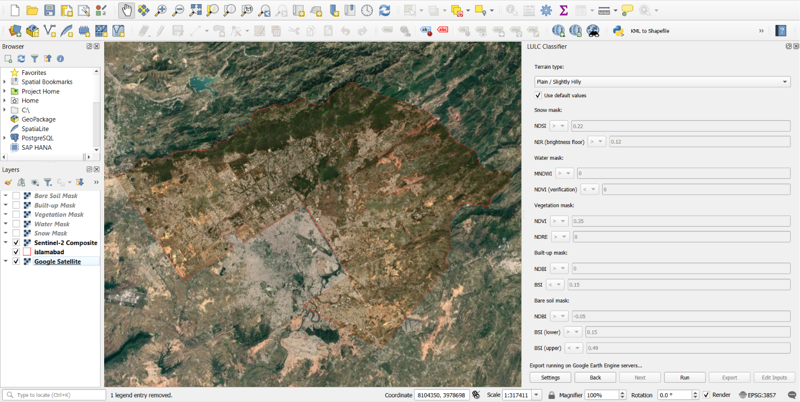
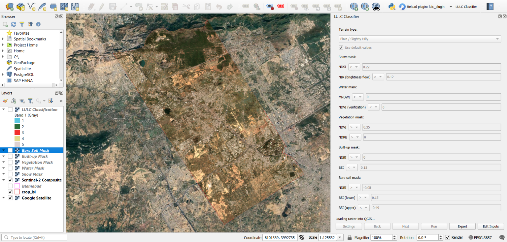

# LULC Classifier

A QGIS plugin that performs Land Use / Land Cover (LULC) classification for any study area using Sentinel-2 imagery processed through Google Earth Engine.

---

## Motivation

Manually classifying land cover in GEE for a new study area means rebuilding the same composite, index, and masking workflow from scratch every time, even if the purpose is just to know the general classification sometimes to aid in analysis. This plugin turns that workflow into a repeatable tool, set an area, a date range, and a terrain type, and get a five-class classification without rewriting any code, and if the result is to your liking you can export it, if not then the virtual layers can aid you in your analysis. It's based on spectral indexes and the thresholds have been tested over multiple study areas but results being accurate can't be guaranteed, hence editable thresholds were added to make it more dynamic.

---

## What this project does

- Takes a user-provided study area shapefile, date range, and cloud cover threshold as input.
- Builds a cloud-masked Sentinel-2 composite for that area and date range on Google Earth Engine's servers.
- Classifies every pixel into one of five classes: **water, vegetation, built-up, bare soil, and snow**.
- Displays a live preview of each class as a layer in QGIS before anything is exported.
- On confirmation, combines the classification into one layer, converts it to vector polygons, and exports it as a shapefile, loaded automatically back into QGIS.
- Lets the user pick a terrain profile (Plain/Hilly or High Elevation) with different default thresholds, and manually edit any threshold if the defaults don't fit their area.

---

## Data / Tools Used

- **Satellite imagery:** Sentinel-2 Surface Reflectance (COPERNICUS/S2_SR_HARMONIZED), 10m resolution
- **Processing platform:** Google Earth Engine (Python API)
- **GIS platform:** QGIS 3.x
- **Language:** Python (PyQt for the plugin interface, Earth Engine Python API for processing)
- **Export:** Earth Engine's direct download URL (no external storage service required)

---

## Methods

- **Cloud masking:** Sentinel-2's QA60 band is used to mask cloud and cirrus pixels before compositing; a median composite is built from the filtered image collection over the user's date range.
- **Water:** Modified Normalized Difference Water Index (MNDWI), cross-checked with NDVI and a connected-pixel filter to reduce false positives from shadow.
- **Vegetation:** NDVI combined with NDRE (red-edge index) as a secondary check to reduce noise at vegetation boundaries.
- **Built-up:** Normalized Difference Built-up Index (NDBI) combined with Bare Soil Index (BSI), since neither index alone reliably separates built-up from bare soil.
- **Bare soil:** BSI-based threshold applied to whatever remains after built-up is removed; any pixel not confidently classified elsewhere defaults to this class.
- **Snow:** Normalized Difference Snow Index (NDSI) combined with a near-infrared brightness floor, since NDSI alone cannot distinguish snow from water (as they share the same formula).
- **Terrain-dependent processing order:** built-up and vegetation are evaluated in a different order depending on terrain type, since mixed rural pixels (trees near buildings) behave differently in flat vs. high-elevation areas.
- All thresholds are exposed to the user as editable `>`/`<`/`=` conditions rather than hardcoded, since no single set of values generalizes perfectly across different landscapes.

---

## Results / Key Findings




- Water and vegetation classification proved reliable across tested terrains (flat urban, river valley, high-elevation) with only minor threshold adjustment.
- Built-up vs. bare soil separation was the most difficult boundary, requiring the most iterative threshold tuning and still showing some residual misclassification in mixed/informal settlement areas.
- Distinguishing agriculture from natural vegetation using single-date imagery (no temporal analysis) was tested with NDVI intensity bands, NDRE, and NDTI, but found unreliable enough that it was excluded from the final classification so vegetation is reported as one combined class.

---

## Limitations

- **Resolution:** Sentinel-2's 10m pixels can't fully resolve small features like thin streams or individual buildings.
- **Cloud gaps:** pixels with no cloud-free observation across the entire date range have no data and appear as gaps, this can't be fixed by the classification logic itself, only reduced by widening the date range.
- **Threshold generalization:** default thresholds are tuned starting points, not guarantees; every study area may need some manual adjustment for accurate results.
- **Built-up/bare soil overlap:** these two classes can have genuinely overlapping spectral signatures at 10m resolution, particularly in mixed rural terrain.
- **No temporal analysis:** by design, this uses a single composite period, which limits how well agriculture can be separated from natural vegetation.
- **Per-user GEE setup required:** each user needs their own free Google Earth Engine and Google Cloud credentials, since these can't be bundled into the plugin.
- **Compute quota:** free-tier Earth Engine accounts have a compute quota; heavy repeated testing in a short window can temporarily throttle or stall processing.
- **Compute quota:** free-tier Earth Engine accounts have a compute quota; heavy repeated testing in a short window can temporarily stop or stall processing.
- **Export size:** exports are downloaded directly from Earth Engine rather than routed through Google Drive; very large study areas with many polygons may need a coarser scale to stay within what a direct download can handle.

---

## How to run it

### Requirements
- QGIS 3.x
- A free Google Earth Engine account
- A Google Cloud project with the Earth Engine API enabled

### One-time setup

**1. Create a Google Earth Engine account**
Go to [signup.earthengine.google.com](https://signup.earthengine.google.com) and sign up (free, for noncommercial/research use).

**2. Create a Google Cloud service account**
1. Go to [console.cloud.google.com](https://console.cloud.google.com).
2. Create a new project (or use an existing one).
3. Search for and enable the **Earth Engine API**.
4. Go to *IAM & Admin → Service Accounts* → create a new service account.
5. Create a **JSON key** for that service account and download it. Keep this file private — treat it like a password.

**3. Enter your credentials into the plugin**
1. Install and enable the plugin in QGIS (see below).
2. Open the plugin and click **Settings**.
3. Enter your service account email and the path to your JSON key file.
4. Click **Save** — this only needs to be done once.

**4. Enter your credentials into the plugin**
1. Install and enable the plugin in QGIS (steps below).
2. Open the plugin and click the **Settings** button in the plugin window.
3. Enter your service account email, the path to your JSON key file, and your Google Drive folder name.
4. Click **Save**, this only needs to be done once.

### Installing the plugin
1. Download or clone this repository.
2. Copy the plugin folder into your QGIS plugins directory:
   - **Windows:** `%APPDATA%\QGIS\QGIS3\profiles\default\python\plugins\`
   - **macOS:** `~/Library/Application Support/QGIS/QGIS3/profiles/default/python/plugins/`
   - **Linux:** `~/.local/share/QGIS/QGIS3/profiles/default/python/plugins/`
3. Open QGIS → *Plugins → Manage and Install Plugins → Installed* → check the box next to **LULC Classifier** to enable it.
4. A new toolbar icon and a *Plugins → LULC Classifier* menu entry will appear.

**Python package requirements:** install into QGIS's own Python environment (not your system Python):
```
"C:\Program Files\QGIS 3.44.1\apps\Python312\python.exe" -m pip install earthengine-api
```
(Adjust the path to match your actual QGIS installation and version. Run this on system command prompt.)

### Usage
1. Click the **LULC Classifier** toolbar icon or menu entry and a dockable panel opens.
2. **Inputs page:** select your study area shapefile (must be in WGS84/EPSG:4326), an output folder, a start/end date, and a max cloud cover percentage. Click **Next**.
3. **Thresholds page:** choose a terrain type, leave "Use default values" checked or edit thresholds manually, then click **Run**.
4. The plugin processes in the background with a live progress label; QGIS remains usable while it runs.
5. Once done, six preview layers appear (composite + five classes). Inspect them freely.
6. Click **Export** to produce the final shapefile, or **Edit Inputs** to adjust and re-run.

### Output
The exported shapefile contains polygon features with two attributes:
- `class:` numeric code (1 = Water, 2 = Vegetation, 3 = Built-up, 4 = Bare Soil, 5 = Snow)
- `class_name:` the same classes as readable text

---

## License

This project is licensed under the MIT License, see the [LICENSE](LICENSE) file for details.